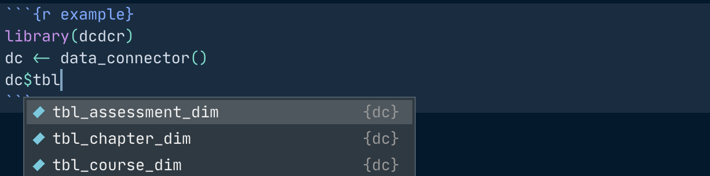
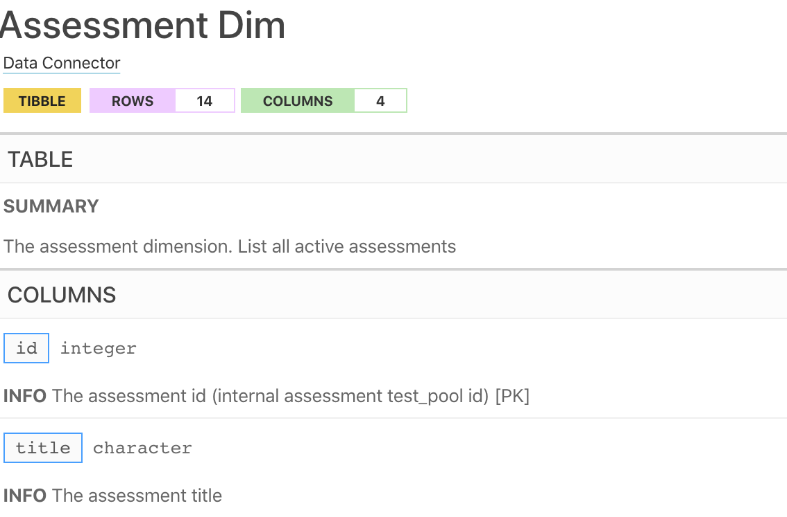

<!-- README.md is generated from README.Rmd. Please edit that file -->

# dcdcr

<!-- badges: start -->

[](https://lifecycle.r-lib.org/articles/stages.html#experimental)
<!-- badges: end -->

This package contains utilities to work with DataCamp Data Connector. It
is designed to be used by administrators and managers of DataCamp
groups. Some prior experience of writing reports with R is recommended.

## Installation

You can install the development version with:

``` r
if (!requireNamespace('remotes', quietly = TRUE)){
  install.packages("remotes")
}
remotes::install_github("datacamp/dcdcr")
```

## Getting Started

Before you begin, you need to enable Data Connector in your DataCamp
group, and set S3 credentials as environment variables, as described in
this [this Support
article](https://support.datacamp.com/hc/en-us/articles/4405070893591-DataCamp-Data-Connector-A-Step-by-Step-Configuration-Guide-for-Automated-Data-Exports).
If in doubt, speak to your Customer Success Manager.

## Accessing Data

You can access any of the tables in the data connector by initializing
it using the `data_connector` function and using autocomplete to access
all the tables.



By default the connector is set up to access data for the latest date.
However, you can also pass a `date` argument to `dc_data_connector` to
initialize it to access data for a specific date. This is useful when
you want to create reports and want to pin your analysis to data as on a
specific date.

``` r
library(dcdcr)
dc <- data_connector()
dc$tbl_assessment_dim()
#> # A tibble: 14 × 4
#>       id title                                   slug                 technology
#>    <int> <chr>                                   <chr>                <chr>     
#>  1  1663 Data Manipulation with Python           data-manipulation-w… Python    
#>  2  1649 R Programming                           r-programming        R         
#>  3  1979 Data Visualization with R               data-visualization-… R         
#>  4  1688 Machine Learning Fundamentals in R      machine-learning-fu… R         
#>  5  1679 Python Programming                      python-programming   Python    
#>  6  1815 Data Analysis in SQL (PostgreSQL)       data-analysis-in-sql SQL       
#>  7  1714 Machine Learning Fundamentals in Python machine-learning-fu… Python    
#>  8  1645 Data Manipulation with R                data-manipulation-w… R         
#>  9  1742 Importing & Cleaning Data with Python   importing-cleaning-… Python    
#> 10  1882 Statistics Fundamentals with Python     statistics-fundamen… Python    
#> 11  1874 Understanding and Interpreting Data     understanding-and-i… Theory    
#> 12  1936 Statistics Fundamentals with R          statistics-fundamen… R         
#> 13  1735 Importing & Cleaning Data with R        importing-cleaning-… R         
#> 14  1857 Data Visualization with Python          data-visualization-… Python
```

You can also print the documentation for each table by accessing the
function using autocomplete, but NOT invoking it.

``` r
dc$tbl_assessment_dim
```



All the data accessors are memoized and will cache the results in memory
when they are run for the first time. This should speed up analysis
considerably since the data is already cached in memory.
